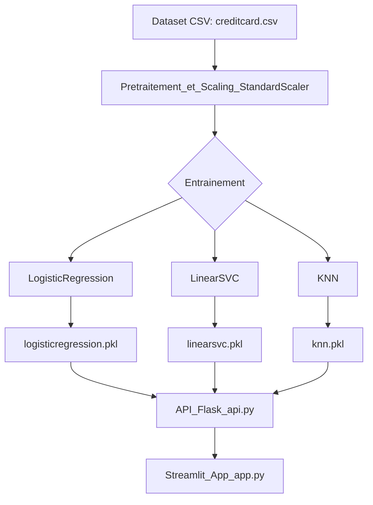

# FraudGuard - Spring 2025

## 📝 Overview

This project implements a machine learning pipeline for credit card fraud detection, featuring a **Flask API** and a **Streamlit app** for user interaction. The project is fully automated using GitHub Actions.

---

## 🚀 Deployed Applications

- **API on Render**: [https://ml-project-api.onrender.com](https://ml-project-api.onrender.com)
- **Streamlit App**: [https://ml-project25.streamlit.app](https://ml-project25.streamlit.app)

---

## 🗂 Project Structure

```file.txt
fraudguard/
├── data/
│   └── creditcard.csv
├── model/
│   ├── confusion_matrix_KNN.png
│   ├── confusion_matrix_LinearSVC.png
│   ├── confusion_matrix_LogisticRegression.png
│   ├── feature_importance_LinearSVC.png
│   ├── feature_importance_LogisticRegression.png
│   ├── knn.pkl
│   ├── linearsvc.pkl
│   ├── logisticregression.pkl
│   ├── scaler.pkl
│   └── train_model.py
├── app.py
├── api.py
├── database.py
├── requirements.txt
├── README.md
└── ...
```

---

## ⚙️ Quickstart: Setup & Installation

1. **Clone le dépôt et place-toi dans le dossier :**
   ```bash
   git clone https://github.com/your-username/your-repo.git
   cd your-repo
   ```
2. **Crée un environnement virtuel et active-le :**
   ```bash
   python -m venv venv
   # Sous Windows :
   venv\Scripts\activate
   # Sous Mac/Linux :
   source venv/bin/activate
   ```
3. **Installe les dépendances :**
   ```bash
   pip install -r requirements.txt
   ```
4. **Entraîne les modèles (génère les fichiers .pkl) :**
   ```bash
   python model/train_model.py
   ```
5. **Lance l'API Flask en local :**
   ```bash
   python api.py
   ```
6. **Lance l'application Streamlit en local :**
   ```bash
   streamlit run app.py
   ```

---

## 🚀 Déploiement (Production)

### Déployer l'API sur Render
1. Crée un compte sur [Render](https://render.com/) et connecte ton repo GitHub.
2. Crée un nouveau **Web Service** et configure :
   - **Build Command** : `pip install -r requirements.txt`
   - **Start Command** : `python api.py`
3. Déploie le service. L'URL de l'API sera affichée sur Render.

### Déployer l'app Streamlit
1. Va sur [Streamlit Cloud](https://share.streamlit.io/) et connecte ton repo GitHub.
2. Indique le chemin du fichier Streamlit (`app.py`).
3. Lance le déploiement. L'URL de l'app sera générée automatiquement.

---

## 🤖 Automatisation CI/CD avec GitHub Actions

Le pipeline CI/CD automatise :
- L'entraînement et la sauvegarde des modèles (`train_model.py`)
- Le commit automatique des modèles générés dans le repo
- Le déclenchement du déploiement API sur Render

**Extrait du workflow `.github/workflows/ci_cd.yml` :**

```yaml
name: CI/CD Pipeline

on:
  push:
    branches: [main]
  pull_request:
    branches: [main]

jobs:
  train-and-commit-models:
    runs-on: ubuntu-latest
    steps:
      - uses: actions/checkout@v4
      - uses: actions/setup-python@v5
        with:
          python-version: '3.9'
      - run: pip install -r requirements.txt
      - run: python model/train_model.py
      - name: Commit models
        run: |
          git config --global user.name "GitHub Actions"
          git config --global user.email "actions@github.com"
          git add model/*.pkl
          git commit -m "Update models via CI" || echo "No changes to commit"
          git push || echo "No changes to push"

  deploy-api:
    needs: train-and-commit-models
    runs-on: ubuntu-latest
    steps:
      - uses: actions/checkout@v4
      - uses: actions/setup-python@v5
        with:
          python-version: '3.9'
      - run: pip install requests
      - name: Trigger Render Deploy
        run: |
          SERVICE_ID="${{ secrets.RENDER_SERVICE_ID }}"
          API_TOKEN="${{ secrets.RENDER_TOKEN }}"
          curl -s -X POST \
            -H "Authorization: Bearer $API_TOKEN" \
            -H "Accept: application/json" \
            -H "Content-Type: application/json" \
            -d '{"clearCache": "do_not_clear"}' \
            "https://api.render.com/v1/services/$SERVICE_ID/deploys"
```

---

## 📊 Comparaison des modèles

| Modèle                | Accuracy | Précision (fraude) | Recall (fraude) | F1-score (fraude) |
|-----------------------|----------|--------------------|-----------------|-------------------|
| **LogisticRegression**| 1.00     | 0.83               | 0.64            | 0.72              |
| **LinearSVC**         | 1.00     | 0.83               | 0.59            | 0.69              |
| **KNN**               | 1.00     | 0.93               | 0.81            | 0.86              |

- **KNN** offre le meilleur compromis entre précision et rappel pour la détection de fraude.
- **LogisticRegression** et **LinearSVC** ont une précision élevée mais un rappel plus faible sur la classe fraude.
- Tous les modèles atteignent une accuracy globale de 1.00 à cause du déséquilibre du dataset.

---

## 🏗️ Architecture du projet

L'architecture globale du projet est illustrée ci-dessous. Ce schéma Mermaid est **directement interprété par GitHub** :



---

## 📄 Additional Documentation

### Key Files

* **`model/train_model.py`** : Script to train and save models.
* **`api.py`** : Flask API code.
* **`app.py`** : Streamlit app code.
* **`requirements.txt`** : Dependencies for the local environment.

---

## 🙏 Acknowledgments

* **Render** for hosting the API.
* **Streamlit Sharing** for hosting the Streamlit app.
* **GitHub Actions** for automating the CI/CD pipeline.

---

## 📧 Contact

For questions or feedback, contact me at [your-email@example.com](mailto:your-email@example.com).

---

### **How to Use This File**

1. Copy this content into a file named `README.md` in the root of your repository.
2. Replace placeholders (e.g., `your-username`, `your-repo`, `your-api-url.onrender.com`) with the appropriate values.
3. Push the file to your GitHub repository:
   ```bash
   git add README.md
   git commit -m "Add final project documentation"
   git push origin main
   ``` 
